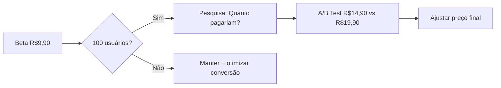

# Estratégia de Agentes de IA para TaskAndPay - Empresa AI First

## Contexto

Você é um desenvolvedor técnico que constrói e publica a plataforma TaskAndPay. Para conquistar os **100 primeiros usuários pagantes**, você precisa de agentes de IA para funções de negócio.

## Meta Principal

> **100 usuários pagantes no plano Premium** (modelo Free Trial de 14 dias + Assinatura)

---

## 💰 Estratégia de Pricing

| Aspecto | Valor |
|---------|-------|
| **Preço Beta** | R$ 9,90/mês |
| **Preço Alvo** | A validar (R$ 19,90 - R$ 29,90) |
| **Modelo** | Free Trial 14 dias → Assinatura mensal |

### Estratégia de Validação de Preço



**Táticas para descobrir preço ideal:**
1. **Pesquisa pós-conversão**: Email automático após 30 dias perguntando "Quanto você pagaria?"
2. **Análise de churn**: Monitorar cancelamentos vs preço percebido
3. **Comparativo de mercado**: Apps de tarefas/mesada cobram R$15-30/mês

---

## 🤖 Mapa de Agentes de IA

### 🚀 **CEO Agent** (Coordenador Central)

| Aspecto | Descrição |
|---------|-----------|
| **Objetivo** | Orquestrar todos os agentes e manter foco na meta de 100 pagantes |
| **Responsabilidades** | Monitorar métricas, identificar gargalos, delegar tarefas, reportar progresso |
| **Frequência** | Diário (análise rápida) / Semanal (relatório completo) |
| **Ferramenta** | Gemini API + n8n para automação |
| **Detalhes** | [Ver documento completo do CEO Agent](file:///C:/Users/conta/.gemini/antigravity/brain/1d5dbc7a-3b9b-456f-88df-488a1bb7afc6/ceo_agent.md) |

---

### 1. **Agente de Criação de Conteúdo** (Content Creator)

| Aspecto | Descrição |
|---------|-----------|
| **Objetivo** | Criar conteúdo para atrair pais interessados em educação financeira infantil |
| **Responsabilidades** | Posts para redes sociais, artigos para blog/SEO, scripts de vídeo |
| **Plataformas Alvo** | Instagram, LinkedIn, TikTok, Blog SEO |
| **Ferramenta** | **Gemini API** + prompts customizados |
| **Frequência** | Diária (posts) / Semanal (artigos) |

**Prompt Base (Gemini):**
```
Você é um especialista em marketing de conteúdo para produtos de educação financeira infantil. 
O TaskAndPay é uma plataforma que ajuda pais a gerenciar tarefas e mesadas dos filhos com IA.

Crie [tipo de conteúdo] para [plataforma] que:
- Fale sobre os benefícios de ensinar finanças para crianças
- Mostre como tarefas com recompensa ajudam no desenvolvimento
- Use tom empático e prático para pais ocupados
- Inclua call-to-action para experimentar gratuitamente (14 dias grátis)

Público-alvo: Pais de 25-45 anos, classe média, interessados em educação infantil moderna.
```

---

### 2. **Agente de Automação de Vendas** (Sales Automation)

| Aspecto | Descrição |
|---------|-----------|
| **Objetivo** | Converter leads em usuários pagantes |
| **Responsabilidades** | Follow-up de trials, emails de onboarding, reativação |
| **Ferramenta** | **n8n (self-hosted)** + Gemini para personalização |
| **Integração** | Webhooks do backend (trial_started, trial_ending) |

**Sequência de Emails (14 dias de Trial):**

| Dia | Assunto | Objetivo |
|-----|---------|----------|
| D+0 | "Bem-vindo ao TaskAndPay! 🎉" | Onboarding |
| D+1 | "Dica: Crie 3 tarefas para começar" | Ativação |
| D+3 | "João pode ganhar sua primeira mesada hoje!" | Engajamento |
| D+7 | "⚠️ Metade do trial! Veja o que você desbloqueou" | Valor |
| D+11 | "Faltam 3 dias - Continue por apenas R$9,90/mês" | Urgência |
| D+13 | "Última chance! Seu trial expira amanhã" | Conversão |
| D+16 | "Sentimos sua falta - 30% OFF para voltar" | Reativação |

---

### 3. **Agente de Atendimento ao Cliente** (Customer Support)

| Aspecto | Descrição |
|---------|-----------|
| **Objetivo** | Resolver dúvidas automaticamente |
| **Canal** | Widget no site + WhatsApp |
| **Ferramenta** | **Typebot (self-hosted)** + Gemini |

**Prompt do Agente:**
```
Você é o assistente virtual do TaskAndPay.

Regras:
1. Seja empático e acolhedor - pais têm pouco tempo
2. Respostas curtas (máximo 3 frases)
3. Se não souber, colete email para resposta humana
4. Nunca invente features

Contexto:
- Free Trial: 14 dias
- Plano Premium: R$ 9,90/mês
- Filho acessa via WhatsApp
- IA sugere tarefas por idade
```

---

### 4. **Agente de Aquisição de Leads** (Lead Generation)

| Aspecto | Descrição |
|---------|-----------|
| **Objetivo** | Encontrar e qualificar potenciais clientes organicamente |
| **Plataformas** | Facebook Groups, Instagram, LinkedIn |
| **Ferramenta** | Manual + Gemini para criar respostas |

**Comunidades Prioritárias:**
| Plataforma | Tipo | Exemplos |
|------------|------|----------|
| Facebook | Grupos de mães | "Mães que...", "Maternidade..." |
| Facebook | Educação infantil | "Educação de filhos", "Pais conscientes" |
| Instagram | Hashtags | #educaçãofinanceira #mesadainfantil #tarefasemcasa |
| LinkedIn | Hashtags | #parentingtech #edtech #financeforeducation |

---

### 5. **Agente de Análise de Dados** (Analytics)

| Aspecto | Descrição |
|---------|-----------|
| **Objetivo** | Entender o funil e otimizar |
| **Ferramenta** | **Posthog (self-hosted)** ou backend próprio + Gemini |

**Métricas para 100 pagantes:**
| Métrica | Meta | Cálculo |
|---------|------|---------|
| Visitantes únicos | 5.000/mês | Analytics |
| Taxa de cadastro | 5% | = 250 trials |
| Taxa de ativação | 60% | = 150 ativos |
| Conversão Trial→Paid | 40% | = **100 pagantes** |

---

## 🛠️ Stack Self-Hosted (Custo Mínimo)

| Função | Ferramenta | Custo |
|--------|------------|-------|
| **LLM** | Gemini API | ~R$ 50-150/mês |
| **Automação** | n8n (Docker) | Grátis |
| **Chatbot** | Typebot (Docker) | Grátis |
| **Analytics** | Posthog (Docker) | Grátis |
| **Email** | Resend | Grátis até 3k/mês |
| **Hosting** | Cloud Run / VPS | R$ 50-100/mês |

**Custo Total Estimado:** R$ 100-250/mês

---

## 📈 Plano Orgânico de Longo Prazo

### Fase 1: Fundação (Mês 1-2) — Meta: 10 pagantes

| Ação | Frequência | Responsável |
|------|------------|-------------|
| Posts Instagram/LinkedIn | 1/dia | Agente Content |
| Artigos SEO | 2/mês | Agente Content |
| Engajamento em grupos | 30min/dia | Você + Agente |
| Emails de trial | Automático | n8n |

**Investimento em Ads (baixo):** R$ 200-300/mês
- Facebook/Instagram Ads para "pais" + "mesada" + "tarefas"
- Objetivo: awareness e primeiros trials

---

### Fase 2: Crescimento (Mês 3-4) — Meta: 50 pagantes

| Ação | Frequência | Responsável |
|------|------------|-------------|
| Parcerias com micro-influencers | 2/mês | Você |
| Depoimentos de usuários | Constante | Automático |
| Webinar "Educação Financeira para Crianças" | 1/mês | Você + Gemini |
| Guest posts | 2/mês | Agente Content |

**SEO Keywords Alvo:**
- "como ensinar finanças para crianças"
- "app de mesada"
- "tarefas para crianças com recompensa"
- "educação financeira infantil app"

---

### Fase 3: Escala (Mês 5-6) — Meta: 100 pagantes

| Ação | Frequência | Responsável |
|------|------------|-------------|
| Refinar preço baseado em dados | Uma vez | Analytics |
| Programa de referral ("Indique e ganhe") | Lançar | Backend |
| Case studies de famílias | 2/mês | Content |
| Expansão para TikTok | 3x/semana | Content |

---

## 🎯 Próximos Passos Imediatos

1. **Semana 1**: Configurar n8n + sequência de emails de trial
2. **Semana 2**: Deploy Typebot com FAQ básico
3. **Semana 3**: Criar 20 posts iniciais com Gemini
4. **Semana 4**: Iniciar ads e engajamento orgânico

---

## 📁 Arquivos de Configuração Necessários

Para implementar esta estratégia, precisaremos criar:

| Arquivo | Descrição |
|---------|-----------|
| `prompts/content-creator.md` | Prompt completo do agente de conteúdo |
| `prompts/customer-support.md` | Prompt do chatbot de suporte |
| `prompts/sales-email.md` | Templates de email para cada etapa |
| `n8n/trial-workflow.json` | Workflow de automação de trial |
| `typebot/faq-flow.json` | Fluxo do chatbot de FAQ |

