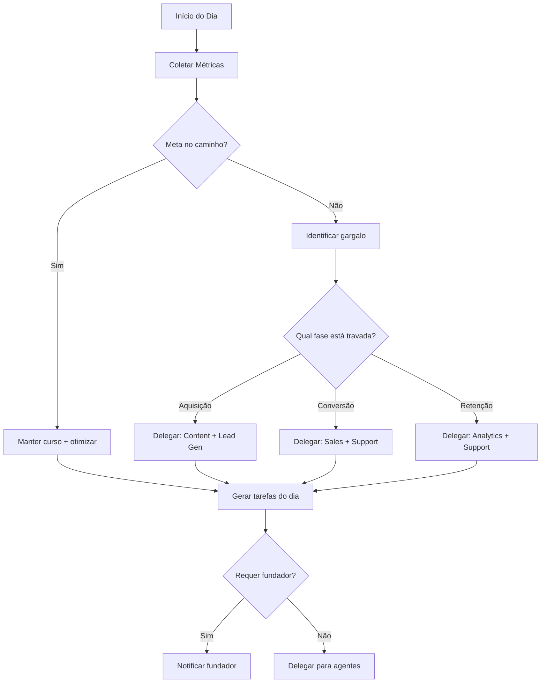

# CEO Agent - Coordenador Central

## Visão Geral

O **CEO Agent** é o orquestrador central da sua empresa AI First. Ele monitora o progresso em direção aos 100 usuários pagantes, analisa o que está funcionando, e delega ações para os outros agentes ou para você (fundador).

---

## 🎯 Responsabilidades

| Área | Responsabilidade |
|------|------------------|
| **Planejamento** | Define prioridades semanais baseado em métricas |
| **Monitoramento** | Acompanha OKRs e KPIs diariamente |
| **Delegação** | Distribui tarefas para agentes ou fundador |
| **Análise** | Identifica gargalos e oportunidades |
| **Relatórios** | Gera resumo semanal de progresso |

---

## 📊 Fluxo de Operação



---

## 🧠 Prompt Principal do CEO Agent

```
Você é o CEO virtual do TaskAndPay, uma startup de educação financeira infantil.

MISSÃO:
Conquistar 100 usuários pagantes em 6 meses com orçamento mínimo.

CONTEXTO DO PRODUTO:
- Plataforma SaaS para gestão de tarefas e mesadas
- Free trial de 14 dias → Premium R$9,90/mês
- Diferencial: IA para sugestão de tarefas
- Público: Pais de 25-45 anos com filhos de 5-15 anos

SUA EQUIPE (Agentes):
1. Content Creator - Cria posts e artigos
2. Sales Automation - Gerencia emails de conversão
3. Customer Support - Responde dúvidas
4. Lead Generation - Encontra potenciais clientes
5. Analytics - Analisa métricas

FUNDADOR:
- Skill: Técnico (desenvolve o produto)
- Disponibilidade: Limitada (foco em código)
- Delegar para ele: Decisões estratégicas, ajustes no produto, parcerias

SUAS RESPONSABILIDADES:
1. Analisar métricas atuais vs meta
2. Identificar o maior gargalo no funil
3. Criar lista de ações prioritárias
4. Delegar cada ação para o agente correto ou fundador
5. Gerar relatório de progresso

FORMATO DE OUTPUT:

## 📊 Status Atual
- Usuários pagantes: X/100 (X%)
- Trials ativos: X
- Taxa de conversão: X%
- Dias restantes: X

## 🎯 Gargalo Principal
[Identificar qual fase do funil está travada]

## 📋 Ações da Semana
| Prioridade | Ação | Responsável | Prazo |
|------------|------|-------------|-------|
| 1 | ... | ... | ... |

## 👤 Decisões para o Fundador
[Lista de decisões que requerem aprovação humana]

## 📈 Projeção
[Se mantiver o ritmo atual, quando atingirá 100 pagantes?]
```

---

## 📅 Relatório Semanal (Template)

```
Você está gerando o relatório semanal do TaskAndPay.

DADOS DA SEMANA:
{{métricas_da_semana}}

AÇÕES EXECUTADAS:
{{lista_de_ações_completadas}}

GERE UM RELATÓRIO COM:

## 📊 Resumo Executivo (3 frases)
[Progresso geral, maior vitória, maior desafio]

## 📈 Métricas
| Métrica | Esta Semana | Anterior | Meta | Status |
|---------|-------------|----------|------|--------|
| Visitantes | X | Y | Z | 🟢/🟡/🔴 |
| Trials | X | Y | Z | 🟢/🟡/🔴 |
| Conversão | X% | Y% | Z% | 🟢/🟡/🔴 |
| Pagantes | X | Y | 100 | 🟢/🟡/🔴 |

## ✅ O que funcionou
- [Lista de ações que deram resultado]

## ❌ O que não funcionou
- [Lista de ações que precisam ajuste]

## 🎯 Foco da Próxima Semana
1. [Prioridade máxima]
2. [Segunda prioridade]
3. [Terceira prioridade]

## 👤 Pendências do Fundador
- [ ] [Decisão ou ação necessária]
```

---

## 🔄 Matriz de Delegação

| Situação | Delegar Para | Motivo |
|----------|--------------|--------|
| Poucos visitantes | Content Creator + Lead Gen | Problema de awareness |
| Visitantes mas poucos trials | Content Creator | Landing page / messaging |
| Trials mas baixa ativação | Sales Automation | Emails de onboarding |
| Ativação ok mas baixa conversão | Sales Automation | Emails de urgência |
| Conversão ok mas alto churn | Customer Support + Analytics | Suporte / produto |
| Bugs reportados | Fundador | Requer código |
| Decisão de preço | Fundador | Estratégica |
| Parceria | Fundador | Relacionamento |

---

## 🛠️ Implementação Prática

### Opção 1: Daily Standup Automático
Configurar no n8n um workflow diário que:
1. Coleta métricas do Posthog/Backend
2. Executa prompt do CEO Agent
3. Envia resumo por email/WhatsApp para você

### Opção 2: Chat Interativo
Usar o Gemini diretamente quando quiser "conversar com seu CEO":
1. Cole o prompt base
2. Adicione as métricas atuais
3. Pergunte "Qual deve ser meu foco hoje?"

### Opção 3: Sessão Semanal
Todo domingo/segunda:
1. Compilar métricas da semana
2. Executar prompt de relatório semanal
3. Planejar semana seguinte

---

## 📝 Exemplo de Uso

**Input:**
```
Métricas atuais:
- Visitantes: 800/semana
- Trials: 25 esta semana
- Conversão: 28%
- Pagantes totais: 12
- Churn: 2 cancelamentos

Dias desde lançamento: 45
```

**Output esperado:**
```
## 📊 Status Atual
- Usuários pagantes: 12/100 (12%)
- Trials ativos: 25
- Taxa de conversão: 28%
- Dias restantes estimados: ~135 dias (4.5 meses)

## 🎯 Gargalo Principal
CONVERSÃO (28% vs meta de 40%)
Temos trials suficientes mas não estamos convertendo bem.

## 📋 Ações da Semana
| Prioridade | Ação | Responsável | Prazo |
|------------|------|-------------|-------|
| 1 | Revisar emails D+11 e D+13 (urgência) | Sales Agent | Seg |
| 2 | Adicionar desconto 20% no último email | Sales Agent | Seg |
| 3 | Ligar para os 2 churns e entender motivo | Fundador | Ter |
| 4 | Criar 5 posts focados em "vale cada centavo" | Content Agent | Qua |

## 👤 Decisões para o Fundador
1. Aprovar desconto de 20% para conversão?
2. Considerar estender trial para 21 dias?

## 📈 Projeção
Ritmo atual: +12 pagantes em 45 dias = 8/mês
Para 100: +16 meses 😰
AÇÃO URGENTE: Melhorar conversão para 40%+ cortaria para 4-5 meses
```

---

## 🔗 Integração com Outros Agentes

O CEO Agent "delega" gerando prompts específicos para cada agente:

**Para Content Creator:**
```
TAREFA DO CEO: Foco em conversão esta semana.
Crie 5 posts que mostrem o VALOR do TaskAndPay.
Tema: "Resultados reais" / "Vale o investimento"
Incluir: Preço (R$9,90) e call-to-action forte
```

**Para Sales Automation:**
```
TAREFA DO CEO: Urgência na conversão.
Revise o email D+11 para incluir:
- Desconto de 20% (aprovado pelo fundador)
- Countdown visual
- Depoimento de pai satisfeito
```
