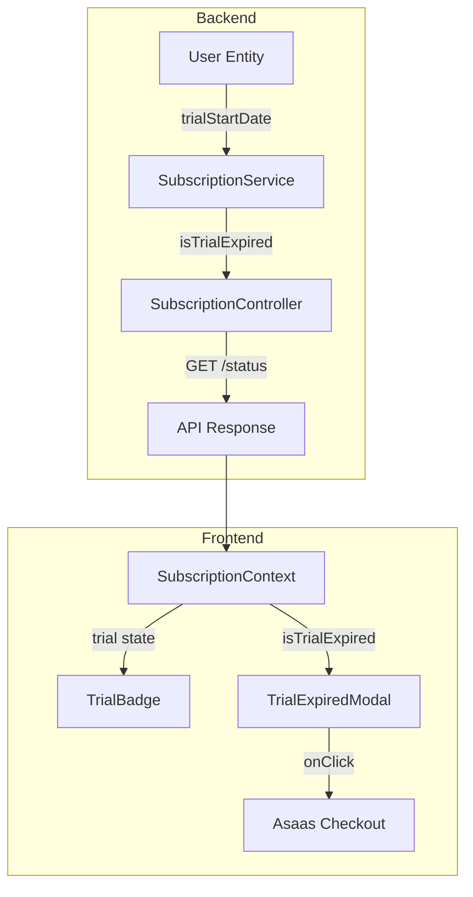

# Especificação Técnica: Migração para Free Trial de 3 Dias

## Resumo Executivo

Este documento descreve o design técnico para migrar o modelo de monetização do TaskAndPay de **Freemium (FREE/PREMIUM)** para **Free Trial de 3 dias + Assinatura obrigatória**. A implementação adiciona um campo `trialStartDate` ao modelo `User`, cria lógica de verificação de expiração no `SubscriptionService`, e introduz componentes frontend para exibir o status do trial e bloquear o acesso após expiração.

A arquitetura permanece um **monólito modular em Java 17/Spring Boot 3.5.7**, utilizando **Firestore** para persistência e a integração existente com **Asaas** para checkout de assinatura.

## Arquitetura do Sistema

### Organização de Domínio

Os seguintes pacotes serão modificados:

| Pacote | Modificação |
|:-------|:------------|
| `identity/` | Adicionar campo `trialStartDate` ao modelo `User` |
| `subscription/` | Implementar lógica de trial no `SubscriptionService` |
| `subscription/dto/` | Atualizar `SubscriptionStatusResponse` com campos de trial |

### Visão Geral dos Componentes



## Design da Implementação

### Modelos de Dados

#### User.java (Modificação)

```java
// Novo campo a ser adicionado
private java.time.Instant trialStartDate; // Data de início do trial (UTC)
```

**Notas:**
- Usar `Instant` (UTC) para consistência de fuso horário
- Campo definido automaticamente no registro
- Usuários existentes sem o campo serão tratados como trial expirado

#### SubscriptionStatusResponse.java (Modificação)

```java
@Data
@Builder
public class SubscriptionStatusResponse {
    private User.SubscriptionTier tier;
    private User.SubscriptionStatus status;
    private String subscriptionId;
    // Novos campos
    private boolean isTrialActive;
    private Integer trialDaysRemaining; // null se não aplicável
}
```

### Interfaces Principais

#### SubscriptionService.java (Novos Métodos)

```java
/**
 * Verifica se o trial do usuário expirou.
 * @return true se trial expirou ou usuário não tem trialStartDate
 */
public boolean isTrialExpired(User user) {
    if (isPremium(user)) return false;
    if (user.getTrialStartDate() == null) return true;
    
    Instant trialEnd = user.getTrialStartDate().plus(3, ChronoUnit.DAYS);
    return Instant.now().isAfter(trialEnd);
}

/**
 * Retorna dias restantes do trial.
 * @return null se Premium, 0 se expirado, ou número de dias
 */
public Integer getTrialDaysRemaining(User user) {
    if (isPremium(user)) return null;
    if (user.getTrialStartDate() == null) return 0;
    
    Instant trialEnd = user.getTrialStartDate().plus(3, ChronoUnit.DAYS);
    long hours = ChronoUnit.HOURS.between(Instant.now(), trialEnd);
    if (hours <= 0) return 0;
    return (int) Math.ceil(hours / 24.0);
}
```

### Endpoints da API

#### GET /api/v1/subscription/status (Modificação)

**Request:** N/A (usa autenticação do usuário logado)

**Response (200 OK):**
```json
{
  "tier": "FREE",
  "status": null,
  "subscriptionId": null,
  "isTrialActive": true,
  "trialDaysRemaining": 2
}
```

**Cenários de resposta:**

| Estado | tier | isTrialActive | trialDaysRemaining |
|:-------|:-----|:--------------|:-------------------|
| Trial ativo (dia 1-3) | FREE | true | 1-3 |
| Trial expirado | FREE | false | 0 |
| Assinante ativo | PREMIUM | false | null |

## Componentes Frontend

### SubscriptionContext.tsx (Modificação)

```typescript
interface SubscriptionContextType {
    // Existentes
    isPremium: () => boolean;
    canCreateTask: (count: number) => boolean;
    // Novos
    isTrialActive: () => boolean;
    isTrialExpired: () => boolean;
    trialDaysRemaining: number | null;
}
```

### TrialBadge.tsx (Novo Componente)

**Localização:** `frontend/src/components/TrialBadge.tsx`

**Comportamento:**
- Exibe badge no header durante trial ativo
- Texto: "🎁 Trial: X dias restantes" ou "⏰ Trial: Xh restantes"
- Visível apenas quando `isTrialActive() === true`

### TrialExpiredModal.tsx (Novo Componente)

**Localização:** `frontend/src/components/TrialExpiredModal.tsx`

**Comportamento:**
- Modal fullscreen, z-index alto, sem botão de fechar
- Renderizado quando `isTrialExpired() === true`
- Botão CTA chama `subscriptionService.subscribe()`

**Layout:**
```
┌─────────────────────────────────────────┐
│                                         │
│     ⏰ Seu período de teste terminou    │
│                                         │
│   Continue aproveitando o TaskAndPay    │
│   com todas as funcionalidades:         │
│                                         │
│   ✓ Tarefas ilimitadas                  │
│   ✓ Sugestões de IA                     │
│   ✓ Loja de Gift Cards                  │
│   ✓ Relatórios financeiros              │
│                                         │
│        [  Assinar Agora  ]              │
│                                         │
└─────────────────────────────────────────┘
```

## Análise de Impacto

| Componente Afetado | Tipo de Impacto | Descrição & Risco | Ação Requerida |
|:-------------------|:----------------|:------------------|:---------------|
| `User.java` | Schema Change | Adiciona campo `trialStartDate`. Baixo risco. | Nenhuma migração, campo opcional |
| `IdentityService.java` | Lógica de Registro | Define `trialStartDate = Instant.now()`. Baixo risco. | Testar registro |
| `SubscriptionService.java` | Nova Lógica | Métodos `isTrialExpired()`, `getTrialDaysRemaining()`. Médio risco. | Testes unitários |
| `SubscriptionContext.tsx` | Estado Frontend | Novo estado de trial. Médio risco. | Testes E2E |
| Header/Layout | UI Change | Novo componente TrialBadge. Baixo risco. | Verificação visual |

## Abordagem de Testes

### Testes Unitários (Backend)

**Arquivo:** `SubscriptionServiceTest.java`

| Cenário | Método de Teste |
|:--------|:----------------|
| Trial ativo retorna false para `isTrialExpired` | `testIsTrialExpired_withinTrial_returnsFalse` |
| Trial expirado retorna true | `testIsTrialExpired_afterThreeDays_returnsTrue` |
| Premium nunca expira | `testIsTrialExpired_premiumUser_returnsFalse` |
| Dias restantes calcula corretamente | `testGetTrialDaysRemaining_returnsCorrectDays` |
| Usuário sem `trialStartDate` é tratado como expirado | `testIsTrialExpired_noTrialStartDate_returnsTrue` |

**Comando:** `./mvnw test -Dtest=SubscriptionServiceTest`

### Testes E2E (Frontend)

**Arquivo:** `frontend/e2e/trial.spec.ts`

| Cenário | Teste |
|:--------|:------|
| Badge visível durante trial | `should show trial badge with days remaining` |
| Modal aparece após expiração | `should show blocking modal when trial expired` |
| Modal não pode ser fechado | `should not allow closing the modal` |
| Botão redireciona para checkout | `should redirect to checkout on CTA click` |

**Comando:** `npm run test:e2e -- trial.spec.ts`

## Sequenciamento de Desenvolvimento

### Ordem de Build

1. **Backend: Modelo** - Adicionar `trialStartDate` ao `User.java`
2. **Backend: Registro** - Modificar `IdentityService.java` para definir `trialStartDate`
3. **Backend: Lógica** - Implementar métodos em `SubscriptionService.java`
4. **Backend: API** - Atualizar `SubscriptionStatusResponse` e Controller
5. **Backend: Testes** - Adicionar testes unitários
6. **Frontend: Context** - Atualizar `SubscriptionContext.tsx`
7. **Frontend: Componentes** - Criar `TrialBadge.tsx` e `TrialExpiredModal.tsx`
8. **Frontend: Integração** - Adicionar componentes ao layout
9. **Frontend: Testes E2E** - Criar `trial.spec.ts`

### Dependências Técnicas

- Nenhuma nova dependência externa
- Utiliza integração Asaas existente para checkout

## Monitoramento & Observabilidade

### Logs

| Evento | Nível | Mensagem |
|:-------|:------|:---------|
| Trial expirado | INFO | `Trial expired for user: {userId}` |
| Redirecionamento para checkout | INFO | `User {userId} redirected to checkout from trial modal` |

### Métricas (Futuro)

- `trial_users_active` - Gauge de usuários em trial ativo
- `trial_conversions_total` - Counter de conversões trial → pago

## Considerações Técnicas

### Decisões Chave

| Decisão | Rationale |
|:--------|:----------|
| Usar `Instant` (UTC) | Evita problemas de fuso horário entre cliente e servidor |
| Modal bloqueante no frontend | Experiência consistente; backend valida mas não bloqueia API |
| Trial = 3 dias corridos | Simplicidade de implementação; alinhado com PRD |

### Riscos Conhecidos

| Risco | Probabilidade | Impacto | Mitigação |
|:------|:--------------|:--------|:----------|
| Usuários existentes sem `trialStartDate` | Baixa (sem produção) | Alto | Tratar como expirado (força assinatura) |
| Clock skew cliente/servidor | Baixa | Baixo | Validação sempre no backend; frontend é UX |

### Conformidade com Padrões

- ✅ Segue arquitetura modular definida em `AGENTS.MD`
- ✅ Usa Java 17 e Spring Boot 3.5.7
- ✅ Mantém integração Asaas existente
- ✅ Testes unitários com JUnit (cobertura ≥ 60%)
- ✅ Testes E2E com Playwright
