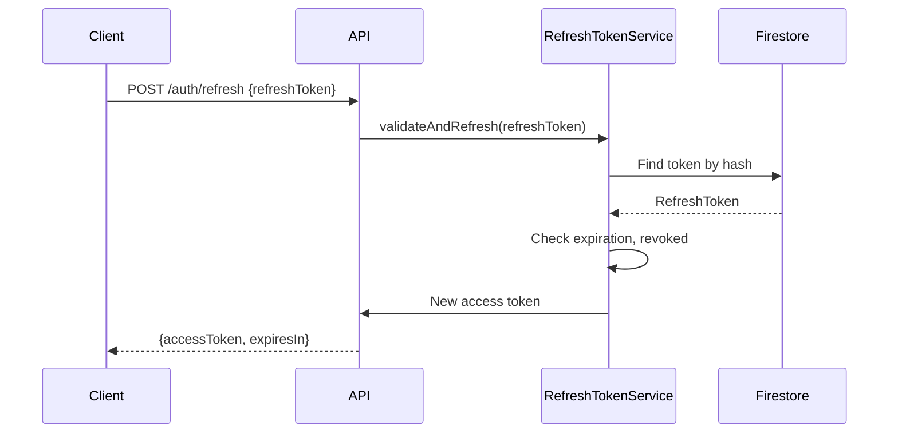

# Task 5.0: Refresh Token Implementation

## Overview

Implement a refresh token mechanism to allow silent token renewal without requiring users to re-authenticate. This improves security by allowing shorter-lived access tokens while maintaining a good user experience.

**MUST READ**: Before starting, review the relevant project rules in `docs/ai_guidance/rules/`.

## Requirements

- Opaque refresh tokens stored in Firestore (not JWT)
- 30-day refresh token validity
- Ability to revoke all tokens for a user (global logout)
- Secure token handling (hash stored, not plaintext)
- New `/api/v1/auth/refresh` endpoint

## Subtasks

### Backend

- [ ] 5.1 Create `RefreshToken` model class for Firestore
- [ ] 5.2 Create `RefreshTokenRepository` for Firestore operations
- [ ] 5.3 Create `RefreshTokenService` interface and implementation
- [ ] 5.4 Implement `createRefreshToken()` - generates opaque token, stores SHA-256 hash
- [ ] 5.5 Implement `validateAndRefresh()` - validates token, returns new access token
- [ ] 5.6 Implement `revokeAllTokens()` - marks all user tokens as revoked
- [ ] 5.7 Add `POST /api/v1/auth/refresh` endpoint to `AuthController`
- [ ] 5.8 Modify login response to include refresh token
- [ ] 5.9 Add `POST /api/v1/auth/logout-all` endpoint for global logout
- [ ] 5.10 Write unit tests for `RefreshTokenService`
- [ ] 5.11 Write integration tests for refresh flow

### Frontend

- [ ] 5.12 Update auth service to store refresh token (secure storage)
- [ ] 5.13 Implement automatic token refresh on 401 response
- [ ] 5.14 Add axios interceptor for transparent token refresh
- [ ] 5.15 Clear refresh token on logout
- [ ] 5.16 Add "Logout from all devices" option in settings

## Implementation Details

### From Tech Spec - Data Model

```java
@Data
public class RefreshToken {
    private String id;
    private String userId;
    private String tokenHash;        // SHA-256 hash of token
    private Instant expiresAt;       // +30 days
    private Instant createdAt;
    private boolean revoked;
}
```

**Firestore Path**: `refreshTokens/{tokenId}`

### From Tech Spec - Interface

```java
public interface RefreshTokenService {
    String createRefreshToken(String userId);
    Optional<String> validateAndRefresh(String refreshToken);
    void revokeAllTokens(String userId);
}
```

### API Endpoints

| Method | Path | Description | Rate Limit |
|--------|------|-------------|------------|
| POST | `/api/v1/auth/refresh` | Refresh access token | 20/min/user |
| POST | `/api/v1/auth/logout-all` | Revoke all refresh tokens | 5/min/user |

### Refresh Flow



### Relevant Files

- `backend/src/main/java/com/fazquepaga/taskandpay/security/RefreshToken.java` [NEW]
- `backend/src/main/java/com/fazquepaga/taskandpay/security/RefreshTokenRepository.java` [NEW]
- `backend/src/main/java/com/fazquepaga/taskandpay/security/RefreshTokenService.java` [NEW]
- `backend/src/main/java/com/fazquepaga/taskandpay/controller/AuthController.java` [MODIFY]
- `frontend/src/services/authService.ts` [MODIFY]
- `frontend/src/services/api.ts` [MODIFY]
- `frontend/src/pages/Settings.tsx` [MODIFY]

### Security Considerations

- Store only SHA-256 hash of refresh token in Firestore
- Use secure random generation for token value
- Clear refresh token from client on logout
- Implement rotation: issue new refresh token on each refresh (optional enhancement)

## Success Criteria

- [ ] Login returns both access token and refresh token
- [ ] Access token can be refreshed using refresh token
- [ ] Refresh tokens expire after 30 days
- [ ] Global logout revokes all user tokens
- [ ] Frontend automatically refreshes token on 401
- [ ] Revoked tokens cannot be used
- [ ] All tests pass
- [ ] Code is reviewed and approved
