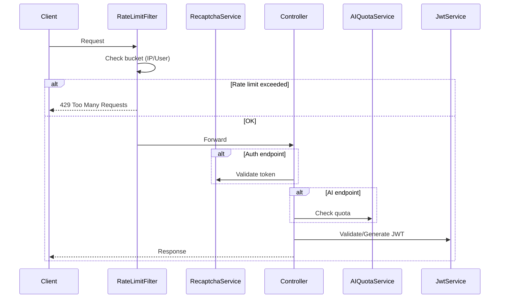

# Technical Specification: Mecanismos de Segurança e Proteção de Custos

## Executive Summary

Esta especificação técnica detalha a implementação de mecanismos de segurança para o TaskAndPay, focando em **proteção de custos** através de rate limiting in-memory, quotas de IA, e hardening de autenticação.

**Decisões-chave para MVP**:
- Rate limiting **in-memory** (Caffeine) sem Redis para reduzir custos
- reCAPTCHA v3 **gratuito** para proteção anti-bot
- Refresh tokens com **30 dias** de validade
- Quotas de IA: **5/dia (Free)**, **10/dia (Premium)**

---

## System Architecture

### Domain Placement

```
backend/src/main/java/com/fazquepaga/taskandpay/
├── security/
│   ├── JwtService.java          # [MODIFY] Usar Secret Manager
│   ├── RateLimitFilter.java     # [NEW] Filtro global
│   ├── RateLimitConfig.java     # [NEW] Configuração Bucket4j
│   ├── RecaptchaService.java    # [NEW] Validação reCAPTCHA
│   └── RefreshTokenService.java # [NEW] Gerenciamento refresh tokens
├── ai/
│   └── AIQuotaService.java      # [NEW] Controle de quotas
└── config/
    └── SecurityConfig.java      # [MODIFY] Adicionar filtro
```

### Component Overview



---

## Implementation Design

### Core Interfaces

```java
// RateLimitService - Controle de rate limiting
public interface RateLimitService {
    boolean tryConsume(String key, int tokens);
    long getAvailableTokens(String key);
}

// AIQuotaService - Controle de quotas de IA
public interface AIQuotaService {
    boolean canUseAI(String userId);
    void recordUsage(String userId);
    int getRemainingQuota(String userId);
}

// RecaptchaService - Validação anti-bot
public interface RecaptchaService {
    boolean verify(String token, String action);
    float getScore(String token);
}

// RefreshTokenService - Gerenciamento de refresh tokens
public interface RefreshTokenService {
    String createRefreshToken(String userId);
    Optional<String> validateAndRefresh(String refreshToken);
    void revokeAllTokens(String userId);
}
```

### Data Models

#### AIQuota (Firestore: `users/{userId}/quotas/ai`)

```java
@Data
public class AIQuota {
    private String userId;
    private int usedToday;           // Contagem do dia
    private LocalDate lastResetDate; // Data do último reset
    private int dailyLimit;          // 5 (Free) ou 10 (Premium)
}
```

#### RefreshToken (Firestore: `refreshTokens/{tokenId}`)

```java
@Data
public class RefreshToken {
    private String id;
    private String userId;
    private String tokenHash;        // SHA-256 do token
    private Instant expiresAt;       // +30 dias
    private Instant createdAt;
    private boolean revoked;
}
```

### API Endpoints

| Method | Path | Descrição | Rate Limit | reCAPTCHA |
|--------|------|-----------|------------|-----------|
| POST | `/api/v1/auth/login` | Login pai | 10/min/IP | ✅ |
| POST | `/api/v1/auth/register` | Registro | 5/min/IP | ✅ |
| POST | `/api/v1/auth/refresh` | Renovar token | 20/min/user | ❌ |
| POST | `/api/v1/children/login` | Login filho | 10/min/IP | ✅ |
| POST | `/api/v1/tasks/suggest` | Sugestão IA | 5/min/user | ❌ |

#### Novo Response Header para Rate Limit

```http
HTTP/1.1 429 Too Many Requests
X-RateLimit-Limit: 10
X-RateLimit-Remaining: 0
X-RateLimit-Reset: 1704067200
Retry-After: 30
```

---

## Integration Points

### GCP Secret Manager

```yaml
# application.yml
spring:
  cloud:
    gcp:
      secretmanager:
        enabled: true

jwt:
  secret: ${sm://jwt-signing-key}  # Referência ao Secret Manager
```

**Ação necessária**: Criar secret `jwt-signing-key` no GCP Console.

### Google reCAPTCHA v3

```yaml
# application.yml
recaptcha:
  site-key: ${RECAPTCHA_SITE_KEY}
  secret-key: ${RECAPTCHA_SECRET_KEY}
  threshold: 0.5
  verify-url: https://www.google.com/recaptcha/api/siteverify
```

**Ação necessária**: Registrar domínio em [Google reCAPTCHA Admin](https://www.google.com/recaptcha/admin).

---

## Impact Analysis

| Componente Afetado | Tipo de Impacto | Risco | Ação |
|--------------------|-----------------|-------|------|
| `JwtService.java` | Refatoração | Baixo | Mover secret para env var |
| `SecurityConfig.java` | Modificação | Baixo | Adicionar `RateLimitFilter` |
| `AuthController.java` | Modificação | Médio | Adicionar validação reCAPTCHA |
| `TaskController.java` | Modificação | Baixo | Verificar quota antes de IA |
| `ChildController.java` | Modificação | Médio | Adicionar reCAPTCHA + novo TTL |
| Frontend (login) | Modificação | Médio | Integrar reCAPTCHA widget |

---

## Testing Approach

### Unit Tests

| Componente | Cenários |
|------------|----------|
| `RateLimitService` | Bucket cheio, bucket vazio, reset após período |
| `AIQuotaService` | Quota disponível, quota esgotada, reset diário |
| `RecaptchaService` | Score acima/abaixo threshold, API error |
| `RefreshTokenService` | Token válido, expirado, revogado |

### Integration Tests

```java
@SpringBootTest
@AutoConfigureMockMvc
class RateLimitIntegrationTest {
    
    @Test
    void shouldReturn429_whenRateLimitExceeded() {
        // Fazer 11 requests em sequência
        // Assert: 10 passam, 11º retorna 429
    }
}
```

---

## Development Sequencing

### Build Order

1. **JwtService refactor** - Mover secret para variável de ambiente
2. **RateLimitFilter** - Rate limiting in-memory com Caffeine
3. **AIQuotaService** - Quotas de IA no Firestore
4. **RecaptchaService** - Integração backend
5. **Frontend reCAPTCHA** - Adicionar widget nos forms
6. **RefreshTokenService** - Implementar refresh flow
7. **Testes** - Unit + Integration

### Technical Dependencies

| Dependência | Status | Responsável |
|-------------|--------|-------------|
| Spring Cloud GCP Secret Manager | Adicionar ao pom.xml | Dev |
| reCAPTCHA site key | Registrar no Google | Ops/Dev |
| Bucket4j + Caffeine | Adicionar ao pom.xml | Dev |

---

## Monitoring & Observability

### Métricas (Logs Estruturados)

```java
// Exemplo de log para rate limit
log.warn("Rate limit exceeded: ip={}, endpoint={}, bucket={}", 
         clientIp, requestPath, remainingTokens);

// Exemplo de log para quota IA
log.info("AI quota used: userId={}, remaining={}, plan={}", 
         userId, remaining, userPlan);
```

### Alertas Sugeridos (Fase 2)

| Métrica | Condição | Ação |
|---------|----------|------|
| Rate limit hits | > 100/hora | Email para admin |
| AI quota exhausted | > 50 users/dia | Revisar limites |
| reCAPTCHA failures | > 20% requests | Investigar bots |

> **Nota**: Dashboard dedicado é opcional para MVP. Os logs estruturados permitem análise via Cloud Logging.

---

## Technical Considerations

### Key Decisions

| Decisão | Escolha | Trade-off |
|---------|---------|-----------|
| Rate limit storage | **In-memory (Caffeine)** | Não persiste entre restarts, mas evita custo de Redis |
| Quota storage | **Firestore** | 1 read/write por request de IA, custo aceitável |
| reCAPTCHA | **v3 gratuito** | Limite de 1M verificações/mês |
| Refresh token | **Opaco + Firestore** | Permite revogação, mas adiciona 1 query |

### Known Risks

| Risco | Mitigação |
|-------|-----------|
| Rate limit perde estado no restart | Limites generosos, restart rápido no Cloud Run |
| Caffeine usa memória | Configurar max size, TTL curto |
| reCAPTCHA pode bloquear legítimos | Score threshold configurável |

### Standards Compliance

- ✅ Segue padrões de API REST (`api-rest-http.md`)
- ✅ Usa Spring Security (`use-java-spring-boot.md`)
- ✅ Testes com JUnit 5 + Mockito (`tests.md`)
- ✅ Firestore para quotas (`firestore-nosql.md`)

---

## Appendix: Maven Dependencies

```xml
<!-- Rate Limiting -->
<dependency>
    <groupId>com.bucket4j</groupId>
    <artifactId>bucket4j-core</artifactId>
    <version>8.7.0</version>
</dependency>

<!-- Caffeine Cache -->
<dependency>
    <groupId>com.github.ben-manes.caffeine</groupId>
    <artifactId>caffeine</artifactId>
    <version>3.1.8</version>
</dependency>

<!-- GCP Secret Manager (se ainda não existir) -->
<dependency>
    <groupId>com.google.cloud</groupId>
    <artifactId>spring-cloud-gcp-starter-secretmanager</artifactId>
</dependency>
```

## Appendix: Configuração reCAPTCHA Frontend

```typescript
// React hook para reCAPTCHA v3
import { useGoogleReCaptcha } from 'react-google-recaptcha-v3';

const { executeRecaptcha } = useGoogleReCaptcha();

const handleLogin = async (credentials) => {
  const recaptchaToken = await executeRecaptcha('login');
  await api.login({ ...credentials, recaptchaToken });
};
```
